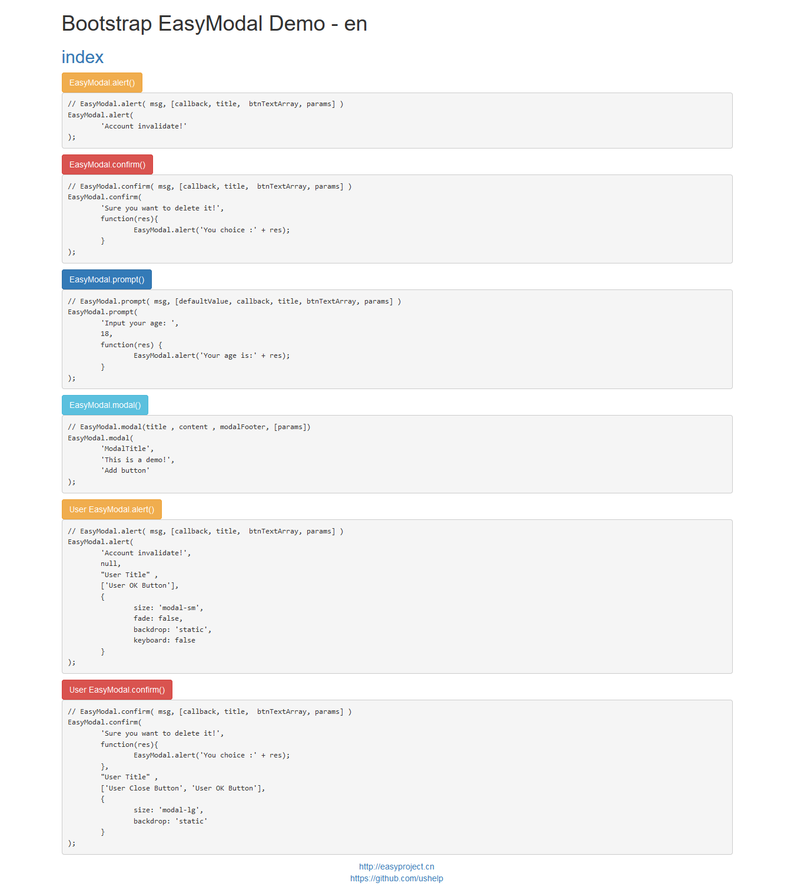
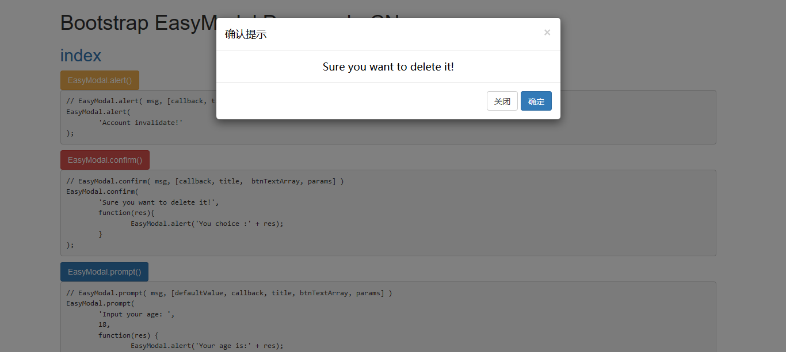

# EasyModal - Bootstrap

---------------

EasyModal 是一个 Bootstrap 模态框扩展插件，能提供 `alert`, `confirm`, `prompt`, `modal 自定义` 等功能，简单易用。

EasyModal is a Bootstrap Modal extension plugin, can provide `alert`, `confirm`, `prompt`, `modal custom function`  and so on, simple and easy to use.

latest version:  `1.2.0-RELEASE`


## 安装

- Download 

- Bower

```
bower install easymodal-bootstrap
```

- npm

```
npm install easymodal-bootstrap
```

## Getting started/开始使用

```HTML
<!-- Bootstrap start -->
<link rel="stylesheet" href="bootstrap-3.3.7-dist/css/bootstrap.min.css">
<script src="jquery/jquery-3.1.0.min.js"></script>
<script src="bootstrap-3.3.7-dist/js/bootstrap.min.js"></script>
<!-- Bootstrap end -->

<!-- Bootstrap EasyModal START -->
<script src="dist/easy.bootstrap.easymodal-1.2.0.min.js"></script>
<!-- put your locale files after easy.bootstrap.easymodel.js -->
<script src="dist/lang/easy.bootstrap.easymodal-lang-en.js"></script>
<!-- Bootstrap EasyModal END -->
```


## API

### Core API
```JS
EasyModal.alert( msg, [callback, title,  btnTextArray, params] );	
EasyModal.confirm( msg, [callback, title,  btnTextArray, params] );
EasyModal.prompt( msg, [defaultValue, callback, title, btnTextArray, params] );		
EasyModal.modal(title , content , modalFooter, [params]);
```

### params
```JS
{
    // 'modal-sm', '', 'modal-lg'; default is ''; the modal size
    // 模态对话框大小； 可选值 'modal-sm', '', ' modal-lg'； 默认为 ''
    size: '', 
    // true, false; default is true; enable fadeIn and fadeOut effect
    // 开启渐入渐出动画效果；可选值 true, false； 默认为 true 
    fade: true,
    // true, 'static'; default is true; specify 'static' for a backdrop which doesn't close the modal on click
    // 点击模块背景是否自动关闭, 'static' 为不关闭； 可选值 true, 'static'; 默认为 true
    backdrop: true,
    // true, false; default is true;  specify true for enter ESC key to close modal dialog
    // 键盘上的 esc 键被按下时关闭模态框；可选值 true, false；默认为 true
    keyboard: true
}
```

### Global params
```JS
EasyModal.defaults={
    // 'modal-sm', '', 'modal-lg'; default is ''; the modal size
    size: '', 
    // true, false; default is true; enable fadeIn and fadeOut effect
    fade: true,
    // true, 'static'; default is true; specify 'static' for a backdrop which doesn't close the modal on click
    backdrop: true,
    // true, false; default is true;  specify true for enter ESC key to close modal dialog
    keyboard: true
}
```


## Usage/用例
```JS
<button id="alertBtn" type="button" class="btn btn-warning">EasyModal.alert()</button>
<button id="confirmBtn" type="button" class="btn btn-danger">EasyModal.confirm()</button>
<button id="promptBtn" type="button" class="btn btn-primary">EasyModal.prompt()</button>
<button id="modalBtn" type="button" class="btn btn-info">EasyModal.modal()</button>
<button id="alertBtn2" type="button" class="btn btn-warning">User EasyModal.alert()</button>
<button id="confirmBtn2" type="button" class="btn btn-danger">User EasyModal.confirm()</button>

$(function() {

    $("#alertBtn").on("click", function() {
    	// EasyModal.alert( msg, [callback, title,  btnTextArray, params] )	
    	EasyModal.alert('Account invalidate!');
    })

    $("#confirmBtn").on("click", function() {
    	// EasyModal.confirm( msg, [callback, title,  btnTextArray, params] )	
    	EasyModal.confirm('Sure you want to delete it!', function(res) {
    		EasyModal.alert('You choice :' + res);
    	});
    })

    $("#promptBtn").on("click", function() {
    	// EasyModal.prompt( msg, [defaultValue, callback, title, btnTextArray, params] )	
    	EasyModal.prompt('Input your age: ', 18, function(res) {
    		EasyModal.alert('Your age is:' + res);
    	});
    })

    $("#modalBtn").on("click", function() {
    	// EasyModal.modal(title , content , modalFooter, [params])
    	EasyModal.modal('ModalTitle', 'This is a demo!', 'Add button');
    })
    
    $("#alertBtn2").on("click", function() {
    	// EasyModal.alert( msg, [callback, title,  btnTextArray, params] )	
    	EasyModal.alert(
    		'Account invalidate!', 
    		null, 
    		"User Title" ,
    		['User OK Button'],
    		{
    			size: 'modal-sm',
    			fade: false,
    			backdrop: 'static',
    			keyboard: false
    		}
    	);
    })

    $("#confirmBtn2").on("click", function() {
    	// EasyModal.confirm( msg, [callback, title,  btnTextArray, params] )	
    	EasyModal.confirm(
    		'Sure you want to delete it!', 
    		function(res){
    			EasyModal.alert('You choice :' + res);
    		}, 
    		"User Title" ,
    		['User Close Button', 'User OK Button'],
    		{
    			size: 'modal-lg',
    			backdrop: 'static'
    		}
    	);
    })
})
```


## Demo






## End

Email：<inthinkcolor@gmail.com>

[http://www.easyproject.cn](http://www.easyproject.cn "EasyProject Home")


**Donation/捐助:**

<a href="http://www.easyproject.cn/donation">
</img></a>
<div>支付宝/微信/QQ/云闪付/PayPal</div>

<br/>

我们相信，每个人的点滴贡献，都将是推动产生更多、更好免费开源产品的一大步。

**感谢慷慨捐助，以支持服务器运行和鼓励更多社区成员。**

We believe that the contribution of each bit by bit, will be driven to produce more and better free and open source products a big step.

**Thank you donation to support the server running and encourage more community members.**
